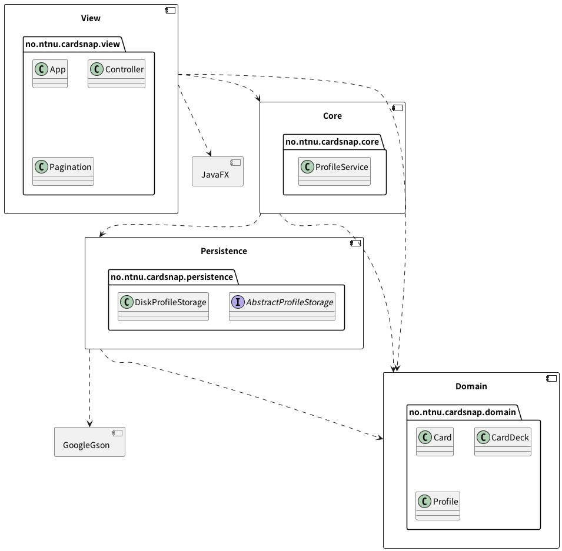
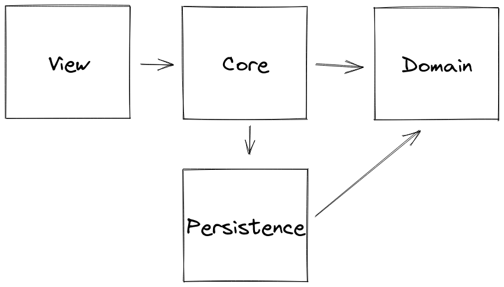

# Release 1

## About this release

This is the second iteration of the CardSnap desktop application. It's now able
to start, showing a stylish view where a user can create both card decks and 
cards inside the decks.

You are unfortunately not able to play through the decks yet, but that is 
the highest priority task we are planning to set up for the next sprint. 
Below we have documented some of the design decisions and architecture 
choices we have made during this release, with user stories at the bottom of 
the document.

## Application Architecture

The application architecture is documented through the following PlantUML 
diagram which gives an excellent overview of the components of the application.

The architecture in use is heavily influenced by domain-driven design which
puts the application domain in the centre with a service layer handling the 
various use-cases the application has. The benefit is that we create loosely 
coupled components that are easy to test individually. Additionally, the
dependency graph strictly becomes a directed, acyclic graph. It also 
implements a model-view-controller (MVC)-like architecture by having the 
JavaFX user interface only respond to the state, trigger state changes, and 
consequently reflecting on the changes in the view.

We've split the application into four independently testable modules. The
modules are as follows:

1. Domain: defines the core types the app domain uses such as `Card`, 
   `Profile`, and `CardDeck`. This layer contains close to no logic because 
   it's just types that the other modules depend on. This module is also 
   handy because you don't want circular dependency graphs between the 
   modules that need the domain types. **Dependencies: none**
2. Persistence: implementations that enable storage and persistence of the 
   types from the Domain module. It has an abstract interface which 
   describes which operations should be available, and for now, contains an 
   implementation that will write JSON to disk. **Dependencies: domain, gson**
3. Core: contains the core domain logic such as creating cards and decks. 
   This is implemented as a service layer, currently exposing 
   `ProfileService` which exposes methods for working with the domain types. 
   **Dependencies: domain, persistence**
4. View: the JavaFX application which calls into the service (core) layer of 
   the application, reflecting on state changes. **Dependencies: core, 
   domain, javafx, domain**

This architecture allows us to focus on the domain (flashcards and their 
use-cases) without having to worry about the user interface.

## Decisions regarding persistence

We have decided that for now, the application only has one profile (there is 
no logins). That profile has a set of card decks, each containing a set of 
cards. Because the relation between these domain types only goes inwards 
(`Profile -> CardDeck -> Card`) we found it suitable to store it in JSON.

The library of choice was Google Gson because it has almost everything that we
need out of the box. It can serialize and deserialize most classes and Java 
standard library data structures automatically, making it really use to use.

The application stores files in a directory named "storage", relative to 
where the application was started. We initially wanted it to store the data 
somewhere consistent, such as the user's home directory, but since we don't 
allow for multiple profiles at the moment, storing it relative to where the 
Java process was started was a good compromise. This means you can 
technically have multiple CardSnap saves stored different places on your 
computer.

## User stories

In this release we have written user-stories for further interaction with 
the app. The following user story has been added to this release:

All [user-stories for the project can be found here](../../userstories.md).

### Create content in app (us-2)

> As a user I want to create Card Decks in the application because I want to 
> create cards in them

The user needs to be able to create an empty deck so it later can contain cards.
As we see it the deck only needs a name. We discussed the need of a description,
but we have chosen to not implement this, because we think that the name will
be descriptive enough.

After the user has created card decks it would be nice to have a list of
available decks. This list should contain some data about the deck, here we
think the number of cards in the deck fits well. The user should also find
buttons to edit/add cards or edit the deck here.

After the user has created a deck, the user should be able to add new cards to
this deck. A card should contain a question and an answer. The user should be
able to add as many questions as they want.

### Edit Card decks (us-3)

**Comment:** We didn't manage to solve this in this iteration, and have chosen
to implement this feature in the next sprint.

> As a user I want to be able to remove card decks because I no longer wish to
> study them

It should be possible to delete an existing card deck when the user doesn't want
to keep it anymore. This can be for a number of reasons:

- They no longer wish to study the cards in the deck, maybe the passed the 
course and no longer need the cards? 
- They created a deck by accident and want to remove it 
- They are finished with a course at school and no longer want that deck to 
  be a part of the app
