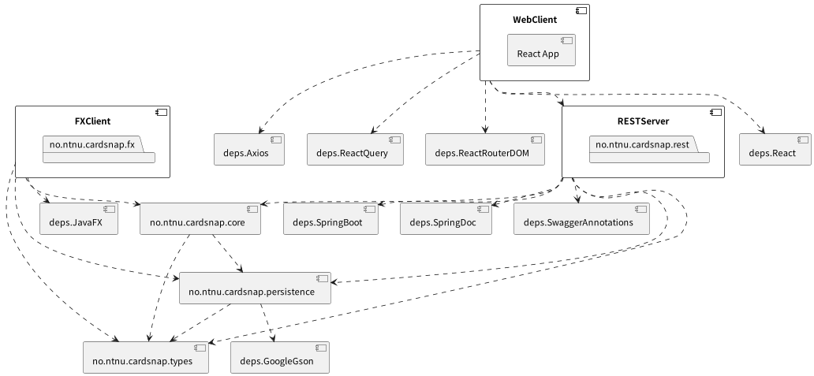
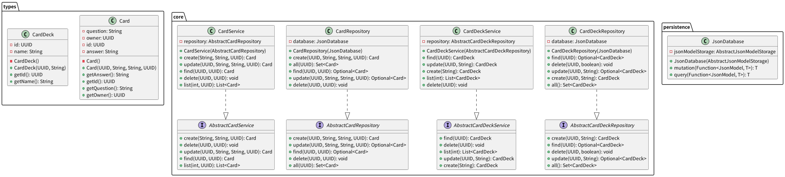

# Release 1

## About this release

In the previous release of our application, we had a simple JavaFX app running with
a Java backend. Due to the expected progress of the project this JavaFX app had
reduced functionality. As planned, we have implemented more functionality in this
release.

In this release, we decided to change the technology of our frontend from
a simple JavaFx-application to an application built with React and TypeScript.
We have also created a REST API with Java, based on our previous backend.
The backend has got more functionality compared to the backend in
our previous release.

This means the JavaFX application has not received any new features, but the
internals have been changed to use the same service layer as the REST API
server application. Thus, the JavaFX application will not be as throughly 
described in this document, because it was documented in the previous releases.

The main motivator for moving to a React-based frontend is in an attempt to 
learn as much as possible from the course. We already felt like we had a 
fair understanding of how JavaFX works, and what we are able to do with it. 
We wanted to see how other alternative clients could compare with JavaFX and 
which benefits and drawbacks each technology has.

We firmly believe this was the correct choice as we've been able to discover 
more of the tools available in the JavaScript ecosystem, and we are now able 
to reason more about the tooling we choose. We discovered that conventions 
differ a lot between the Java and JavaScript ecosystems, but at the same 
time found a lot of similarities between the tools.

The expanded functionality corresponds with user-stories from our issue backlog.

## Application Architecture

The application now has a complete client-server architecture communicating over
the HTTP protocol, using the representational state transfer (REST) server
paradigm.

### Web Frontend

The frontend is responsible for all user interaction within CardSnap, and it is
thus important that it's quick to respond and easy to understand.

It has been rewritten in TypeScript using React. The reason we landed on 
React as the technology for the frontend application is because some of our 
team members had already looked at React before and liked the way it 
abstracted typical DOM tasks into a more functional and component-based way 
of thinking and designing!

While there were a lot of other options on the table such as a mobile client,
we decided that we wanted to use the web, because the web is very accessible,
along with the fact that we've all done some form of web development in the 
past, reducing the barrier of entry and reducing developer friction moving 
between technologies.

#### Built with

- [Typescript](https://www.typescriptlang.org/)
  - JavaScript with syntax for types 💪
- [Vite](https://vitejs.dev/)
  - Blazing fast build tool 🚀
- [React](https://reactjs.org/)
  - Component based JavaScript library for creating user interfaces 🌿
- [Tailwind](https://tailwindcss.com/)
  - Utility-first CSS framework 💅

We decided to use TypeScript which is a "superset" of JavaScript with an 
intricate, yet expressive type system which can ensure that all the data 
types passed to functions have the expected types. We wanted something like 
this because JavaScript on its own has a weak typing system which allows you 
to pass any value into any function. TypeScript resembled a lot of the 
familiarities we found in Java and Java's strong type system.

Additionally, TypeScript works extremely well with React, because all 
components' properties become strongly typed, making it impossible to pass 
the wrong data to a component. This also makes it extremely easy for the 
developers that use the different components, because it's a lot easier to 
see how data is passed down through components.

When we decided to make the swap, we arranged a small workshop for oursevles 
so that all team members would be on the same page, going through both 
React's JSX syntax and the absolute basics of TypeScript. This was essential 
to the productivity of all the members when working on both re-implementing 
the old features from our JavaFX version, as well as implementing new features!

We chose Vite as the build system for the application over Create React App 
which is one of the go-to React templates because Vite allows us to 
customize the build completely to our liking, while Create React App has 
some quirks. It also allowed us to use our own ESLint configuration, while 
Create React App comes with one bundled which is a bit difficult to override.

There are many ways of styling React applications, but we ultimately ended 
up using Tailwindcss. Tailwindcss is a utility CSS framework, providing 
classes such as "text-red-500" or "p-4" to set text colors and element 
padding. This method allows developers to quickly iterate over their design 
ideas, while keeping the code quite concise. It also means that the 
developers don't need to write CSS files themselves, making it easier to 
refactor code because the styling is right next to the JSX!

#### Dependencies

- [react-query](https://tanstack.com/query)
- [axios](https://github.com/axios/axios)
- [React Router](https://reactrouter.com)
- [React](https://reactjs.org/)

These are the "production" runtime dependencies that the application depends 
on. We wanted to keep the list of dependencies minimal.

React Query was chosen as the library to fetch data from our API. Without a 
proper React-tailored library for data fetching, React code will become very 
verbose, because there naturally are many states to handle. React Query also 
comes with an added benefit of caching, meaning that if two components need 
the same data, it only needs to be fetched once, because React Query will 
cache it.

React Query provides simple `useQuery` and `useMutation` React hooks, 
enabling the developer to pass a "fetcher" function, responsible for 
retreiving the data. By providing hooks, we get a reactive state which will 
update itself when the data is fetched (or needs to be refetched after 
mutations).

To make things easier, we decided to use Axios as the main fetcher for React 
Query. Another option on the table was fetch, but some of us were quite 
comfortable with Axios from before so we settled on Axios.

Our application works as a "Single Page Application" (SPA), meaning we need 
some way of creating routes and individual pages in the app. A very popular 
and convenient library for doing this is React Router DOM. React Router 
allows us to compose a set of available routes, and navigate between them, 
without having the browser refresh the page. This was very easy to settle on 
because it's the leading standard for client-side React routing.

#### Structure

Our frontend is written using React. We have followed an opinionated style of
the projects structure to keep it well organized. Here is a simplified
view of our frontend directory structure:

```
└── /src
    ├── /components - Contains reusable components. Each components has it's own unit test to ensure it's intended functionality.
    ├── /helpers    - Contains various helper functions.
    ├── /layouts    - Contains our page layout used for all of our pages.
    ├── /pages      - Contains individual pages.
    ├── /views      - Contains page-specific components.
    ├── /utils      - Contains small utility functions
    ├── app.tsx     - Main React application root
    ├── index.tsx   - Application entrypoint
    └── routes.tsx  - Our React Router configuration which defines the routes for each page.
```

## JavaFX Client

This is the old JavaFX client we built for Release 2 during the second 
sprint. It has not received any new features since, meaning its 
functionality is limited to creating new card decks and cards.

It has, however, received an internal change, making it communicate to the 
shared use-case layer that the REST server talks to inside the `core` Maven 
module.

Because we were not able to complete TestFX integration tests for the second 
release, these have now been added!

#### Built with

- [Java](https://www.java.com/en/)
    - Modern Java, using Java 19
- [JavaFX](https://openjfx.io/)
    - A client application library for Java

#### Dependencies

- [JavaFX](https://openjfx.io/)
- [Gson](https://github.com/google/gson)

Apart from internal packages, there is only one dependency, being JavaFX. 
Additionally, the JavaFX app transitively depends on the Gson library 
because the persistence layer depends on it.

#### Structure

This is the file structure we ended up with for the REST API. It's
relatively small and self-explanatory and it works great for applications of
this size.

```
└── /fx
    ├── /src/main/java/no/ntnu/cardsnap/fx - The App, Controller and utility to run the FX App
    ├── /src/main/resources/no/ntnu/cardsnap/fx - FXML and CSS styling for the app
```

## Backend

The backend application is a refactor of the previous core layer in the JavaFX
release of the app. It now uses Spring Boot to server an API over HTTP.

The backend follows its own three-tier architecture where the different 
responsibilities are split into different layers. This is commonly seen in 
larger-scale applications, where it's preferable to split up into the 
following layers:

1. Gateway (or public) layer: the layer clients can interact with. In this 
   case, through a set of Spring Boot Controllers exposing the HTTP API.
2. Service (or use-case) layer: the layer where the application logic lies, 
   defining the rules of the domain.
3. Repository (or persistence) layer: the layer that is solely responsible 
   for persisting and storing the domain entities.

The architecture is heavily based on Uncle Bob's Clean Architecture, 
displayed in rough terms in the following diagram:


The four layers represented in Clean Architecture are implemented in our 
application by:

1. Entities: are defined in the `types` Maven module, a module containing 
   only domain types. These types have also been made immutable to reduce 
   bugs by altering types in-memory without storing them back to the 
   persistence layer.
2. Use cases: are defined through actions in the service layer. These define 
   the actions the client or use have at their availability. The service 
   layer will also call into the repository layer which will interact with 
   the `persistence` Maven module. The use case layer is built in the `core` 
   Maven module.
3. Gateway: the gateway layer is implemented through the Spring Controllers 
   in the `rest` Maven module
4. External interfaces: are the consumers of the gateway level, in our case, 
   the frontend application.

Maintaining an architecture like this makes it easier to scale and grow the 
application because you define strict boundaries between what can depend on 
what. This architecture is also built to scale horizontally, keeping the code 
complexity relatively low while scaling to hundreds of services because
components are kept small and isolated!

The code is organized in a way it tries to follow the SOLID principles to 
the best of our ability. Each component of the system is responsible for 
one subdomain or one action. The Liskov substitution principle is enabled 
through Spring's inversion of control dependency injection, having Spring 
components consume interfaces, making it possible to swap out the actual 
implementations at the developers wish.

#### Built with

- [Java](https://www.java.com/en/)
  - Modern Java, using Java 19
- [Spring Boot](https://spring.io/projects/spring-boot)
  - An extensive and heavily tested server application framework for Java

Before landing on Spring Boot we also had a look at alternatives such as 
Jakarta or Javalin (which is a newer, but simpler framework). We also had a 
prototype of the application using Javalin, because we though that simpler 
might make it easier, but we ultimately ended up with Spring Boot after 
concluding that Javalin requires us to do too much of the heavy lifting that 
Spring Boot can give us out of the box for free.

#### Dependencies

- [Spring Boot](https://spring.io/projects/spring-boot)
- [SpringDoc](https://springdoc.org/)
- [Swagger Annotations](https://github.com/swagger-api/swagger-core/wiki/Swagger-2.X---Annotations)
- [Gson](https://github.com/google/gson)

Generation of documentation of the RESTful API was done through SpringDoc, a 
library which makes it extremely easy to generate
[OpenAPI specifications](https://swagger.io/) from the Spring controllers. 
This is paired with a Maven plugin to generate the `openapi.json` file at 
build time. When we start the Spring application we can also navigate to 
`http://localhost:8080/swagger-ui/index.html#/` to view a live Swagger UI of 
the API description. Swagger annotations is a dependency that annotations to 
help with the generation of this API description.

View the [api-spec.html file](api-spec.html) in a browser to see the HTML 
report generated by Swagger Generator, explaining which API endpoints are 
available.

Gson was the JSON library we decided to use. It's either this one or Jackson.
We decided that the library doesn't really matter, because we're using it 
for very primitive things, and that the differences between the libraries 
would not matter for our usage.

#### Structure

This is the file structure we ended up with for the REST API. It's 
relatively small and self-explanatory and it works great for applications of 
this size.

```
└── /core
    ├── /src/main/java/no/ntnu/cardsnap/core - Contains domain use-cases 
└── /persistence
    ├── /src/main/java/no/ntnu/cardsnap/persistence - Contains logic for persisting our domain types, as well as a database abstraction. 
└── /rest
    ├── /src/main/java/no/ntnu/cardsnap/rest - Contains main Spring app, configuration and controllers
└── /types
    ├── /src/main/java/no/ntnu/cardsnap/types - Contains domain entity types 
```

## Testing & Tooling

With the new application architecture we have heavily improved both test 
coverage, and different ways to test the application. We now have the 
following types of tests and test suites:

1. Backend unit tests: simpler tests to ensure a smaller component like a 
   single repository works as expected. Tests are written for all 
   components in the backend application. (with JUnit)
2. Backend integration tests: Spring MockMvc tests for the controllers in 
   the application. (with JUnit and Spring MockMvc)
3. Frontend unit tests: snapshot and small interaction tests of smaller 
   React components (with Vitest Snapshot tests)
4. Frontend end-to-end tests: complete end-to-end automated browser tests, 
   testing the entire system using Playwright (alternative to Cypress).
5. JavaFX end-to-end tests: complete end-to-end automated tests, testing the 
   (limited) functionality of the JavaFX app using TestFX.

The unit tests are written to cover most common use cases. Due to time 
limitations we have not been able to cover all edge cases in the system, but 
it's generally not necessary to hit 100% code coverage when we have other 
measures to test the system (like integration and e2e tests).

We decided to use multiple approaches to testing, because this gives the 
most confidence in our system. If we were to only write unit tests, we 
wouldn't be able to ensure the entire system plays nicely together, and if 
we were to only write end-to-end tests, it can be very difficult to cover 
all common cases in all components. This is a good compromise!

Test coverage on the backend application is done using Jacoco, with Vitest's 
integrated c8 coverage collector on the frontend.

To keep code quality to a high standard we've used the following tools to 
ensure that the code style and quality is consistent across the entire codebase.

- Prettier: formatting of all code on the frontend (typescript, tsx)
- ESLint: linting of all code on the frontend
- CheckStyle: style verifier for the backend
- SpotBugs: linter and bug-finder for backend

## Developer workflow

During the entire lifecycle of the project, we've tried to match the 
Agile/Scrum development workflow. We structured our lifecycle such that each 
deliverable on BlackBoard corresponded to one Sprint cycle. This meant that 
each time a new deliverable was posted on BlackBoard, we would sit down 
together for our sprint planning meeting, deciding which things we wanted to 
focus on, which issues to bring from our backlog, and which user stories to 
prioritize.

While our project did not have a product owner, we all agreed and decided 
that Tale would be the Scrum master for our product. We also planned out 
when we wanted to have our regular meetings, and at the end of each meeting 
we always made sure that we picked a time for the next meeting where 
everybody would be available.

During the development, we held "daily" sprints during each meeting. Because 
we are students with other courses and other things happening it did not 
make sense to have a meeting every day. Instead, we aimed to meet twice a 
week, and it was during these meetings that we would perform our stand-up.

The highlight of our agile development process is visible through a lot of 
work done on the GitLab repository. Here we ensured that the following was 
done each sprint:

1. GitLab milestones were created for each sprint, adding issues and merge 
   requests within the sprint to the milestone. Milestones gave us an 
   excellent way of looking through what work has been added, what had been 
   selected, and what had been completed through the kanban board.
2. GitLab merge requests were always peer-reviewed by at least one fellow 
   team member, ensuring that all the code that went into the main branch 
   was agreed upon by at least half of the team.
3. GitLab issues had heavy usage of labels for a number of reasons:
   - `priortity {low,medium,high}` labels to indicate how high of a priority 
     a given issue should take over the other ones. This allowed us to 
     easily determine which things should be worked on before others!
   - `effort {low,medium,high}` labels to indicate how much work we 
     estimated a task to take. This made it easier to use the time each 
     member had dedicated to the project, because you would have some sense 
     of how long time each task would take to complete.
   - `task` and `user story` labels easily separate issues that are user 
     stories, and which tasks are tasks derived from the user stories.
   - `user story {x}` labels were used to mark which issues were related to 
     each user story, making it very easy to see which of the goals an issue 
     contributed to.

Another goal of ours was to keep the main branch as "healthy" as possible. 
The end goal here was to ensure that no matter what, if somebody was to 
clone the main branch of the repository, they would have an application that 
would at least start up.

This meant that pushing directly to main was strictly forbidden, and each 
change would have to go through GitLab merge requests, which where again, 
another team member had to review and test the changes before they went into 
the main branch. Additionally, all merge requests were squash merged, only 
leaving one commit + the merge commit for each merge request. This led to 
less clutter in the Git log, while one can always visit the merged merge 
request on GitLab to see the individual commits done during development and 
review.

We also settled on a standardized naming convention for the branches, making 
it a lot easier to tell which task a git branch is related to. We used the 
following scheme: `[feat|fix|refactor|docs]/#[issue number]-[some-name]`. 
This contributed greatly to the consistency across the entire project.

Commit messages followed a simple, yet concise description of the changes in the
pull request. Because we aimed at keeping pull requests relatively small 
this didn't seem like a problem. While we could have adopted conventional 
commits like suggested in the lectures, we decided that there wasn't too 
much time in the course left to warrant a huge style change.

## User stories

In this release we have written user-stories for further interaction with
the app. The following user story has been added to this release:

All [user-stories for the project can be found here](../../userstories.md).

### Edit Card decks (user story 3)

> As a user I want to be able to remove card decks because I no longer wish to
> study them

It should be possible to delete an existing card deck when the user doesn't want
to keep it anymore. This can be for a number of reasons:

- They no longer wish to study the cards in the deck, maybe the passed the
  course and no longer need the cards?
- They created a deck by accident and want to remove it
- They are finished with a course at school and no longer want that deck to
  be a part of the app

### Edit deck name (user story 4)

> As a user I want to be able to change the name of a card deck because
> I could have made a mistake when creating it

It should be possible to change the name of a deck, possible reasons:

- The user could have made a typo when creating the deck
- The user could want to change to a more appropriate name

### Edit card (user story 5)

> As a user I want to be able to edit a card because
> I may have made a mistake when I created the card

There are many reasons to implement editing of cards. The user
should babe able to edit cards because...

- ...the card could have typos
- ...the answer could be wrong or uncomplete
- ...the card could no longer be relevant
- ...user may have learned more since the card was
  created and could want to add content

### Play decks (user story 6)

> As a user I want to practice by using the decks I have
> created because I want to improve my knowledge

When user opens the list of available decks it should be possible to
select a card deck, and then play with the cards in that deck. The
play-view should contain a card with the question in focus. It should
also be buttons to toggle between cards and a button to show the answer.

### Create deck (user story 7)

> As a user I want to be able to create a new deck in the web
> app, because I want to categorize my cards

If user wants to create a new deck it should be easy to create a new
deck in the app. User should select a name for the deck. We want the user
to be able to select the name becuse this wil makes it easier for user to
understand which decks that contains different kind of cards.

### Add card (user story 8)

> As a user I want to add cards to a deck in web app, because I
> want to improve a certain skill.

User should be able to add a new card to a given card deck
in the web app. The new card should contain a question and an answer.

### Delete card (user story 9)

> As a user I want to be avle to delete a card from a deck
> because I no longer want the card to be a part of the deck.

User should be able to delete an existing card from a given card deck.

-   User may have learned the content on the card well enough
-   The card could contain wrong content
-   User may want to reduce the amount of cards in that deck

## Diagrams

### Sequence diagram

A sequence diagram demonstrating how the entire system processes the user
creating a new card on the website.


> Note: THe JsonDatabase.mutation(new Card("CardID","Q","A","Owner")) from 
> Rest to Persistence is a simplified expression of a lambda expression originally used. 
> This simplification is created for better readability

We chose this as the most important interaction in our application, because 
it's an interaction that covers the entire system, and is also extremely 
central to how a user will use the app.

### Package diagram

A package diagram displaying the different components and packages the entire
system consists of, and how these depend on each other.



### Class diagram

A class diagram, highlighting the most central parts of the application. 
(The entities, the JsonDatabase abstraction, and the various 
services/repositories).



These classes were chosen because they represent the core logic of what 
happens on the backend, and they also represent which actions are available 
as well as the domain types we are working with!
