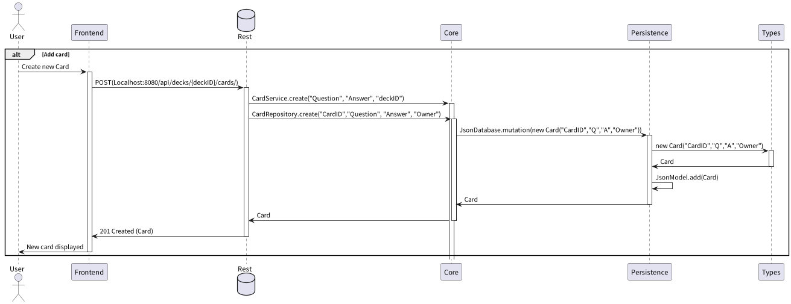

# Release 1

## About this release

In the previous release of our application, we had a simple JavaFX app running with
a Java backend. Due to the expected progress of the project this JavaFX app had
reduced functionality. As planned, we have implemented more functionality in this
release.

In this release, we decided to change the technology of our frontend from
a simple JavaFx-application to an application built with React and TypeScript.
We have also created a REST API with Java, based on our previous backend.
The backend has got more functionality compared to the backend in
our previous release.

The expanded functionality corresponds with user-stories from our backlog.

## Application Architecture

### Frontend

#### Built with

- [Typescript](https://www.typescriptlang.org/)
  - JavaScript with syntax for types 💪
- [Vite](https://vitejs.dev/)
  - Blazing fast build tool 🚀
- [React](https://reactjs.org/)
  - Component based JavaScript library for creating user interfaces 🌿
- [Tailwind](https://tailwindcss.com/)
  - Utility-first CSS framework 💅

#### Dependencies

- [react-query](https://tanstack.com/query)
- [axios](https://github.com/axios/axios)
- [React Router](https://reactrouter.com)
- [React Testing Library](https://testing-library.com/)

#### Structure

Our frontend is written using React. We have followed an opiniated style of the projects structure to keep it well organized. Here is a somewhat simplified view of our frontend structure:

```
└── /src
    ├── /components
    ├── /helpers
    ├── /layouts
    ├── /pages
    ├── /views
    ├── /utils
    ├── app.tsx
    ├── index.tsx
    └── routes.tsx
```

##### `/components`

Contains reusable components. Each components has it's own unit test to ensure it's intended functionality.

##### `/helpers`

Contains various helper functions.

##### `/layouts`

Contains our page layout used for all of our pages.

##### `/pages`

Contains individual pages.

##### `/views`

Contains page-specific components.

##### `routes.tsx`

Our router which defines the routes for each page.

## Backend

## User stories

In this release we have written user-stories for further interaction with
the app. The following user story has been added to this release:

All [user-stories for the project can be found here](../../userstories.md).

### Edit Card decks (user story 3)

**Comment:** We didn't manage to solve this in this iteration, and have chosen
to implement this feature in the next sprint.

> As a user I want to be able to remove card decks because I no longer wish to
> study them

It should be possible to delete an existing card deck when the user doesn't want
to keep it anymore. This can be for a number of reasons:

- They no longer wish to study the cards in the deck, maybe the passed the
  course and no longer need the cards?
- They created a deck by accident and want to remove it
- They are finished with a course at school and no longer want that deck to
  be a part of the app

### Edit deck name (user story 4)

> As a user I want to be able to change the name of a card deck because
> I could have made a mistake when creating it

It should be possible to change the name of a deck, possible reasons:

- The user could have made a typo when creating the deck
- The user could want to change to a more appropriate name

### Edit card (user story 5)

> As a user I want to be able to edit a card because
> I may have made a mistake when I created the card

There are many reasons to implement editing of cards. The user
should babe able to edit cards because...

- ...the card could have typos
- ...the answer could be wrong or uncomplete
- ...the card could no longer be relevant
- ...user may have learned more since the card was
  created and could want to add content

### Play decks (user story 6)

> As a user I want to practice by using the decks I have
> created because I want to improve my knowledge

When user opens the list of available decks it should be possible to
select a card deck, and then play with the cards in that deck. The
play-view should contain a card with the question in focus. It should
also be buttons to toggle between cards and a button to show the answer.

### Create deck (user story 7)

> As a user I want to be able to create a new deck in the web
> app, because I want to categorize my cards

If user wants to create a new deck it should be easy to create a new
deck in the app. User should select a name for the deck. We want the user
to be able to select the name becuse this wil makes it easier for user to
understand which decks that contains different kind of cards.

### Add card (user story 8)

> As a user I want to add cards to a deck in web app, because I
> want to improve a certain skill.

User should be able to add a new card to a given card deck
in the web app. The new card should contain a question and an answer.

### Delete card (user story 9)

> As a user I want to be avle to delete a card from a deck
> because I no longer want the card to be a part of the deck.

User should be able to delete an existing card from a given card deck.

-   User may have learned the content on the card well enough
-   The card could contain wrong content
-   User may want to reduce the amount of cards in that deck

## Diagrams

### Sequencediagram



> Mark: THe JsonDatabase.mutation(new Card("CardID","Q","A","Owner")) from Rest to
> Persistence is a simplified epxresion of a lamdaexpression originaly used. This
> simplification is created for bether readability
